### 日本語チャットの使い方

- [ログイン](#ログイン)
- [移動・伸縮](#移動・伸縮)
- [チャットモード](#チャットモード)
- [チャンネル](#チャンネル)
- [アイテムのリンク](#アイテムのリンク)
- [今までの発言](#今までの発言)
- [よく使う発言](#よく使う発言)
- [ログアウト](#ログアウト)

------

### ログイン

EQを起動し、キャラを選んでログインすると、 
画面の真ん中にチャットバーが表示されます。

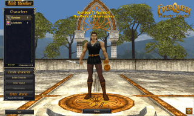

------

### 移動・伸縮

アイコンをドラッグして好きな場所に移動します。

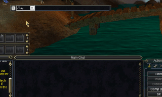

つまみをドラッグして長さを調節します。

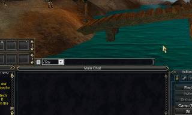

------

### チャットモード

キャラを操作中に`Enter`キーでチャットモードに入ります。

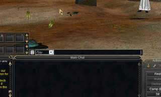

`全角`キーを押して日本語を入力し、`Enter`キーで発言します。

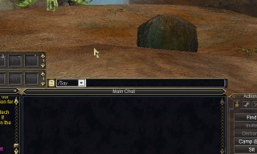

------

### チャンネル

ドロップダウンリストからチャンネルを選べます。

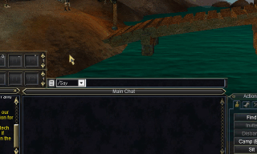

`Alt`+`そのチャンネルの大文字`キーでも選べます。

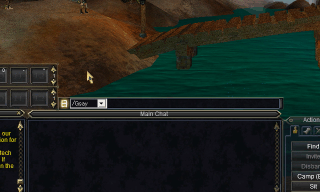

------

### アイテムのリンク

アイコンをクリックしてリンクを貼り付け、 
`Enter`キーでチャットバーに転送します。

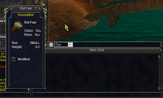

------

### 今までの発言

発言の内容はチャットバーに記録されます。

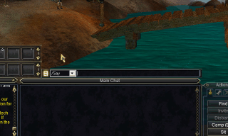

`↑`キーと`↓`キーで記録をたどることができます。

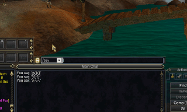

------

### よく使う発言

挨拶などを`Shift`+`Enter`で登録しておくことができます。

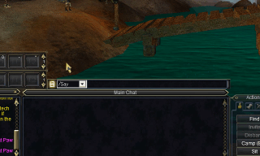

`Shift`+`↑`キーと`Shift`+`↓`キーで登録をたどることができます。

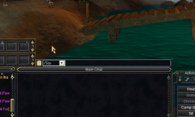

いらなくなったら`Shift`+`Delete`キーで削除できます。

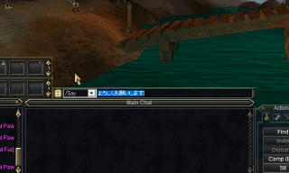

------

### ログアウト

ログアウトすると、チャットバーが閉じられます。

------

以上で使い方の説明は終わりです。 
どうぞ日本語チャットをお楽しみください！😉
