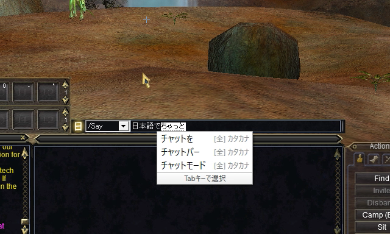
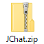
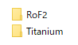
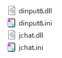
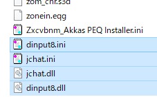

### 日本語チャットプラグインとは？

英語版のEQクライアント(`eqgame.exe`)を拡張して、 
日本語でチャットできるようにするためのDLLです。

------

### インストール

`JChat.zip`を[こちら](../../releases)からダウンロードします。

`JChat.zip`を開くと、クライアントごとにフォルダがあります。

自分が使用しているクライアントのフォルダを開きます。

中に入っているファイルをEQフォルダにコピーします。

これでインストールは完了です。 
EQを起動すれば、日本語でチャットできます。

------

日本語チャットの使い方については[こちら](Documents/USAGE.md)をご覧ください。 
バグの報告などはgonbee2017@outlook.jpまでお願いします。😌
